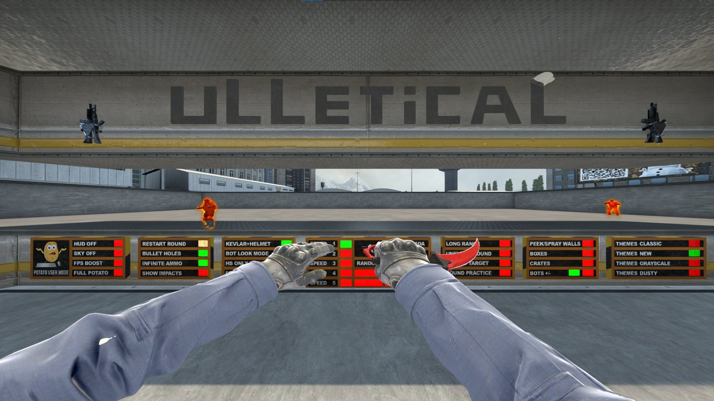

# Gewehr

Gewehr is an internal/external CS:GO hack.

## Features

- [x] Bunnyhop
- [x] Triggerbot
- [x] Glow
- [x] RCS
- [x] Change FOV
- [x] Skin Changer
- [ ] Aimbot

## How to use

- Open in a version of Visual Studio that supports C++20
- Build in x86 Release mode
- Use an injector of your choice to inject the DLL into a process of your choice
- To configure the hack, change the values in `Documents\.gw\config.json` after the first execution.

## Credits
- [https://github.com/0xf1a/xSkins](https://github.com/0xf1a/xSkins) for skin changer and netvar code
- [https://github.com/frk1/hazedumper](https://github.com/frk1/hazedumper) for offset patterns

